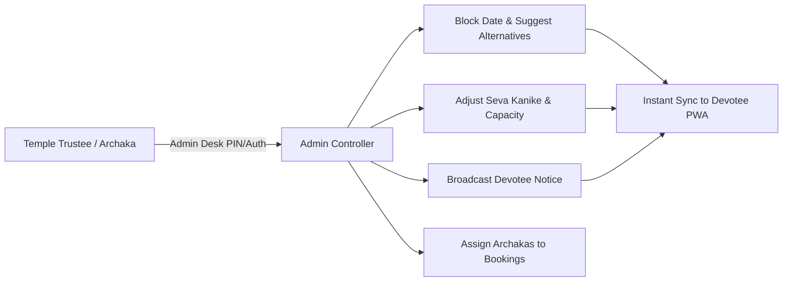

# Administrative Control Desk Specification: Sri Durga Devi Temple

## 1. Administrative Overview & Persona
The Admin Desk (`admin-dashboard`) empowers Temple Trustees, Senior Archakas, and Office Clerks to control the Digital Mandapa in real-time without writing code or deploying server patches.

The interface adheres to the core philosophy: **"Temple Controlled"** — ensuring automated rules never compromise real-world temple traditions or sanctity.

---

## 2. Core Administrative Capabilities

### 2.1 Spiritual Calendar & Date Availability Controller
- **Block Any Date:** Select a date, choose a predefined sacred category (*Grand Festival / Brahmotsava*, *Sanctum Renovation*, *Grahanam / Eclipse*, *Archaka Leave*, *Private Temple Utsavam*).
- **Custom Devotee Notice:** Enter the exact message devotees see on their mobile screens (e.g., *"Sanctum fully reserved for community Chandi Parayana. Individual family homas paused."*).
- **Prescribe Auspicious Alternatives:** Specify 1 to 3 alternate dates so devotees can immediately re-route their sankalpa.
- **Unblock Instantly:** Re-open any blocked date with one click.

### 2.2 Seva Offerings & Kanike Catalog Management
- **Enable/Disable Sevas:** Toggle any seva between Active (accepting bookings) and Paused with an instant toggle switch.
- **Update Contribution (Kanike):** Adjust seva rates (e.g. ₹101 to ₹151) reflecting trustee decisions.
- **Duration & Samagri Edit:** Update items provided by the temple vs items required from the devotee family.

### 2.3 Devotee WhatsApp Booking & Archaka Assignment Desk
- **Incoming Token Stream:** View incoming booking tokens (`SDD-2026-1024-042`) generated by devotees.
- **Archaka Assignment:** Select from hereditary priests on duty (*Pandit Narayana Bhat*, *Pandit Subrahmanya Somayaji*, *Pandit Venkatesh Dixit*) to handle the ritual.
- **Direct WhatsApp Reply:** Trigger pre-formatted confirmation messages back to the devotee's WhatsApp with one tap.

### 2.4 Live Devotee Announcement Broadcast
- Publish high-priority banners to all active devotee devices (e.g., *"Navaratri Darshan hours extended by 1 hour (till 9:30 PM) from 12 Oct to 22 Oct."*).
- Toggle visibility On/Off with immediate effect.
