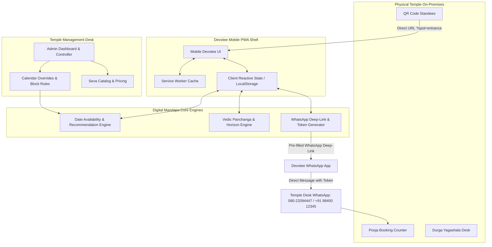

# System Architecture: Sri Durga Devi Temple — Digital Mandapa

## 1. Architectural Philosophy & Overview
Sri Durga Devi Temple Digital Mandapa is engineered as an **offline-capable, mobile-first Progressive Web Application (PWA)** acting as the digital devotee front desk for the historic Sri Durga Parameshwari Temple, Chandra Layout 1st Phase, Bengaluru.

The architecture prioritizes:
1. **Zero-Friction Devotee Access:** No forced app store downloads, no mandatory passwords or OTP barriers for browsing. Instant on-ramp via QR code scanning or Web URL.
2. **Offline Resilience:** Vedic Panchanga, daily temple darshan schedules, and seva guidelines remain accessible even with intermittent mobile network inside the stone temple prakaram.
3. **Temple-Controlled Supremacy:** Administrative decisions (date blocks, festival closures, archaka leaves) strictly take precedence over automated astrological calculations.
4. **WhatsApp as the Official Transaction Channel:** Eliminates high gateway fees and complex online payment compliance for local devotees; enables direct human touchpoint between Archakas and families.



---

## 2. Layered Frontend Component Architecture

```
app/
├── index.html                   # HTML5 Entrypoint with Mobile Viewport & PWA Headers
├── manifest.webmanifest         # PWA Manifest (Icons, theme color, standalone mode)
├── sw.js                        # Service Worker (CacheFirst + StaleWhileRevalidate)
├── src/
│   ├── main.jsx (or index.js)   # Application Mounting & Global Providers
│   ├── App.jsx                  # Main Shell & View Router
│   ├── styles/
│   │   ├── tokens.css           # Design System CSS Variables (Warm Ivory, Maroon, Gold)
│   │   └── app.css              # Mobile utilities, typography, touch target rules
│   ├── components/
│   │   ├── common/
│   │   │   ├── Header.jsx       # Top Sanctum Bar with Live Darshan Indicator
│   │   │   ├── BottomNav.jsx    # 5-Tab Persistent Mobile Navigation
│   │   │   ├── WhatsAppBar.jsx  # Sticky WhatsApp Help & Dispatch Pill
│   │   │   ├── PwaBanner.jsx    # Add to Home Screen On-Ramp Banner
│   │   │   └── Badge.jsx        # Auspicious & Status Badges
│   │   ├── home/
│   │   │   ├── PanchangaStrip.jsx # Compact Today's Vedic snapshot
│   │   │   ├── TimingsCard.jsx    # Current & upcoming darshan / aarti
│   │   │   └── SevaCarousel.jsx   # Popular Poojas & Homas
│   │   ├── pooja/
│   │   │   ├── SevaCard.jsx       # Seva listing item with kanike badge
│   │   │   ├── SplitChecklist.jsx # Temple Provides vs Devotee Brings
│   │   │   └── BookingDrawer.jsx  # Quick date trigger
│   │   ├── calendar/
│   │   │   ├── MonthGrid.jsx      # Vedic calendar with color indicators
│   │   │   ├── BlockedAlert.jsx   # Admin reason banner
│   │   │   └── SmartSuggest.jsx   # 3 alternative date chips
│   │   ├── panchanga/
│   │   │   ├── FiveLimbsGrid.jsx  # Tithi, Nakshatra, Yoga, Karana, Rashi
│   │   │   ├── KaalaWarning.jsx   # Rahu Kala / Yamaganda / Gulika
│   │   │   └── SunArc.jsx         # Astronomical sunrise/sunset arc
│   │   ├── booking/
│   │   │   ├── Stepper.jsx        # 4-Step visual progress
│   │   │   ├── SankalpaForm.jsx   # Name, WhatsApp, Gothra, Rashi, Occasion
│   │   │   └── TokenReview.jsx    # Draft Token & counter instructions
│   │   ├── qr/
│   │   │   └── QrLandingView.jsx  # On-premises contextual helper
│   │   └── admin/
│   │       ├── AdminDesk.jsx      # Metrics, quick block, and inbox
│   │       ├── DateBlocker.jsx    # Form to block dates with public reasons
│   │       ├── SevaEditor.jsx     # Enable/disable sevas & adjust rates
│   │       └── RequestQueue.jsx   # Incoming WhatsApp tokens
│   ├── data/
│   │   ├── sevas.js             # 21 authentic Chandra Layout Temple Sevas
│   │   ├── timings.js           # Real temple timings (Tue/Fri special schedules)
│   │   ├── panchangaData.js     # Astronomical ephemeris for Bengaluru
│   │   └── mockAdminStore.js    # Persistent localStorage for admin overrides
│   └── utils/
│       ├── availability.js      # Availability Engine & Recommendation logic
│       ├── panchangaCalc.js     # Dynamic Tithi, Rahu Kala & solar arc calculator
│       └── whatsappLink.js      # Formatted WhatsApp message string generator
```

---

## 3. Technology Selection & Dependencies
- **PWA Runtime:** Vanilla Modern ES2022 / React / Vite. Minimal footprint (< 120 KB gzip), guaranteed 60fps scrolling on low-end Android mobile devices.
- **Styling:** Design-token-driven CSS3 variables, zero bulky third-party UI component libraries (pure custom implementation matching `.stitch/DESIGN.md`).
- **Icons:** Inline SVG devotional icons (Temple gopuram, diya, sacred lotus, conch, sun/moon, bell, WhatsApp).
- **Offline Storage:** `CacheStorage` for assets + `localStorage` / `IndexedDB` for devotee draft tokens and administrative date blocks.
- **Hosting & Production:** Static hosting deployable on Hostinger (`myworks.sbs/durga` or root) or any modern CDN with HTTPS.
