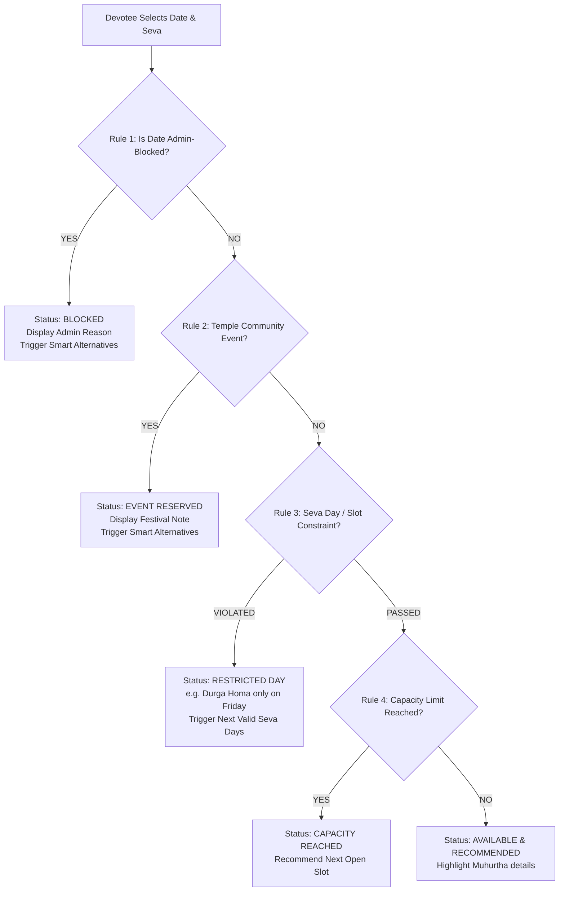

# Date Availability & Recommendation Engine: Sri Durga Devi Temple

## 1. Engine Core Philosophy & Hierarchy
The Date Availability Engine provides intelligent date guidance for devotees seeking to perform sacred rituals (Poojas, Homas, Archanas). 

Traditional Hindu rituals are governed by both **Vedic Muhurtha rules** and **practical Temple Administration rules**. The engine resolves conflicts through an absolute, strict hierarchy:



---

## 2. Rule Precedence Table

| Precedence | Rule Name | Enforced By | Example Scenario | Devotee Experience |
|---|---|---|---|---|
| **1 (Highest)** | **Administrative Block** | Temple Trustees / Archakas | Temple renovation, priest leave, emergency closure | Hard red block: Devotee sees custom reason + 3 suggested alternative dates |
| **2** | **Temple Festival Event** | Annual Temple Calendar | Navaratri Day 4 Chandi Homa, Deepotsava, Brahmotsava | Sanctum reserved for community worship. Individual homas disabled. |
| **3** | **Seva Day Constraint** | Temple Sampradaya Tradition | Durga Homa strictly on Fridays (10 AM); Rahukala Seva strictly on Tuesdays (3:30 PM) | Devotee attempting to book Durga Homa on a Wednesday is redirected to upcoming Fridays. |
| **4** | **Daily Capacity Limit** | Temple Office Slot Ceiling | Max 3 individual homas per day in Yagashala | Status shows "Slots Filled for this date". |
| **5 (Default)** | **Auspicious Availability** | Vedic Panchanga Engine | Shukla Paksha, Friday / Tuesday, auspicious Nakshatra | High-confidence green status with auspicious badge (*"Highly Recommended Muhurtha"*). |

---

## 3. Smart Alternative Recommendation Algorithm

When a devotee's desired date $D_0$ is unavailable or blocked for a specific Seva $S$, the engine runs a search heuristic to generate **3 optimal alternative dates**:

### Search Parameters:
- Search Window: $D_0 + 1$ day to $D_0 + 30$ days (prioritizing forward dates).
- Evaluation Criteria:
  1. Date is NOT in Admin Block store.
  2. Date satisfies $S$'s weekly constraint (e.g. if $S$ requires Friday, filter only Fridays).
  3. Daily booking capacity $< \text{MaxCapacity}$.
  4. Vedic Auspiciousness score $W$ is calculated:
     $$W = W_{\text{Tithi}} + W_{\text{Nakshatra}} + W_{\text{Day}}$$
     - Shukla Paksha Tithi (Ashtami, Navami, Chaturdashi, Pournami): $+25$ pts
     - Auspicious Nakshatra for Durga (Rohini, Uttara, Hasta, Anuradha, Revati): $+20$ pts
     - Traditional Devi Weekday (Friday $+30$ pts, Tuesday $+25$ pts)
     - Proximity penalty: $-2$ pts per day distance from $D_0$.

### Selection:
The engine sorts candidate dates by final score and returns the **top 3 recommendations**, complete with their Vedic Tithi and Nakshatra explanation.

---

## 4. Availability Engine API Contract (JavaScript / TypeScript)

```typescript
interface AvailabilityRequest {
  sevaId: string;
  date: string; // "YYYY-MM-DD"
}

interface AlternativeDate {
  date: string; // "YYYY-MM-DD"
  formattedDate: string; // "Fri, 24 Oct 2026"
  tithi: string; // "Shukla Chaturdashi"
  nakshatra: string; // "Uttara"
  reason: string; // "Auspicious Friday for Durga Homa"
}

interface AvailabilityResult {
  isAvailable: boolean;
  status: 'AVAILABLE' | 'BLOCKED' | 'EVENT_OVERRIDE' | 'DAY_MISMATCH' | 'CAPACITY_FULL';
  publicNotice?: string;
  recommendedAlternatives: AlternativeDate[];
  muhurthaSlot?: {
    startTime: string; // "10:00 AM"
    endTime: string;   // "12:30 PM"
    guidance: string;
  };
}
```
