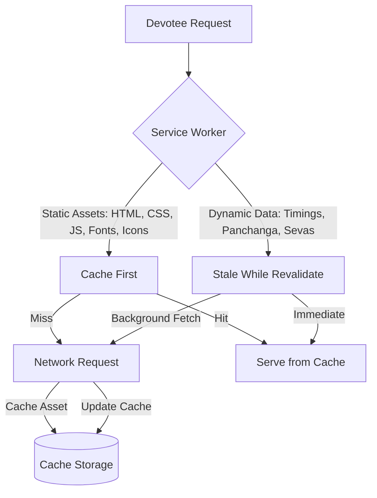

# Progressive Web App (PWA) Specification: Sri Durga Devi Temple

## 1. PWA Identity & Metadata
The Sri Durga Devi Temple Digital Mandapa is configured as a standalone mobile application that devotees can install directly to their mobile home screens with zero app-store friction.

### Web App Manifest (`manifest.webmanifest`)
```json
{
  "name": "Sri Durga Devi Temple — Digital Mandapa",
  "short_name": "Durga Mandapa",
  "description": "Digital devotee front desk, daily Vedic Panchanga, Darshan timings, and Seva bookings for Sri Durga Parameshwari Temple, Chandra Layout.",
  "start_url": "/",
  "id": "/?source=pwa",
  "display": "standalone",
  "orientation": "portrait",
  "background_color": "#FAF7F2",
  "theme_color": "#721C2B",
  "categories": ["lifestyle", "utilities"],
  "icons": [
    {
      "src": "/icons/icon-192.png",
      "sizes": "192x192",
      "type": "image/png",
      "purpose": "any maskable"
    },
    {
      "src": "/icons/icon-512.png",
      "sizes": "512x512",
      "type": "image/png",
      "purpose": "any maskable"
    }
  ],
  "shortcuts": [
    {
      "name": "Today's Panchanga",
      "url": "/#panchanga",
      "description": "Check Tithi, Nakshatra, and Rahu Kala"
    },
    {
      "name": "Book Seva",
      "url": "/#poojas",
      "description": "Explore Poojas, Homas, and Archanas"
    },
    {
      "name": "Temple Timings",
      "url": "/#timings",
      "description": "Daily Darshan and Aarti Schedule"
    }
  ]
}
```

---

## 2. Service Worker & Caching Strategy (`sw.js`)

The Service Worker delivers **instant offline capability** using a layered caching model:



### Cache Buckets:
- `CACHE_STATIC_v1`: App shell (`/`, `/index.html`, `/manifest.webmanifest`, CSS tokens, core JS bundles, SVG icons, fonts).
- `CACHE_DATA_v1`: JSON stores (`sevas.json`, `panchanga_2026.json`, `timings.json`).
- `CACHE_IMAGES_v1`: Temple deity images and banners.

### Offline Fallback:
If an un-cached network request fails, the service worker returns an auspicious, offline-friendly shell presenting:
- Today's pre-computed Panchanga for Bengaluru
- Static temple darshan schedule
- Offline message: *"You are viewing cached temple information. Connect to the internet to dispatch new WhatsApp booking requests."*

---

## 3. Safe-Area Insets & Mobile Viewport
To ensure a native feel on iPhones with Dynamic Island/notches and Android gesture bars:
```html
<meta name="viewport" content="width=device-width, initial-scale=1.0, maximum-scale=1.0, user-scalable=no, viewport-fit=cover">
<meta name="theme-color" content="#721C2B">
<meta name="apple-mobile-web-app-capable" content="yes">
<meta name="apple-mobile-web-app-status-bar-style" content="black-translucent">
<meta name="apple-mobile-web-app-title" content="Durga Mandapa">
```

### CSS Safe-Area Rules:
```css
:root {
  --safe-top: env(safe-area-inset-top, 0px);
  --safe-bottom: env(safe-area-inset-bottom, 0px);
}

.temple-top-bar {
  padding-top: max(12px, var(--safe-top));
}

.bottom-nav-bar {
  padding-bottom: max(8px, var(--safe-bottom));
  height: calc(64px + var(--safe-bottom));
}
```

---

## 4. "Add to Home Screen" On-Ramp UX
- Listens to the browser `beforeinstallprompt` event without displaying annoying intrusive browser popups immediately upon arrival.
- Displays an organic, devotional card banner: *"Keep Sri Durga Devi Temple in your pocket — Instant offline Panchanga, timely festival alerts, and fast seva counter tokens without app stores."*
- For iOS Safari: Automatically detects iOS user agent and displays a gentle 2-step instructional visual: *"Tap the Share button [↑] at the bottom of Safari, then choose 'Add to Home Screen' [+]"*.
