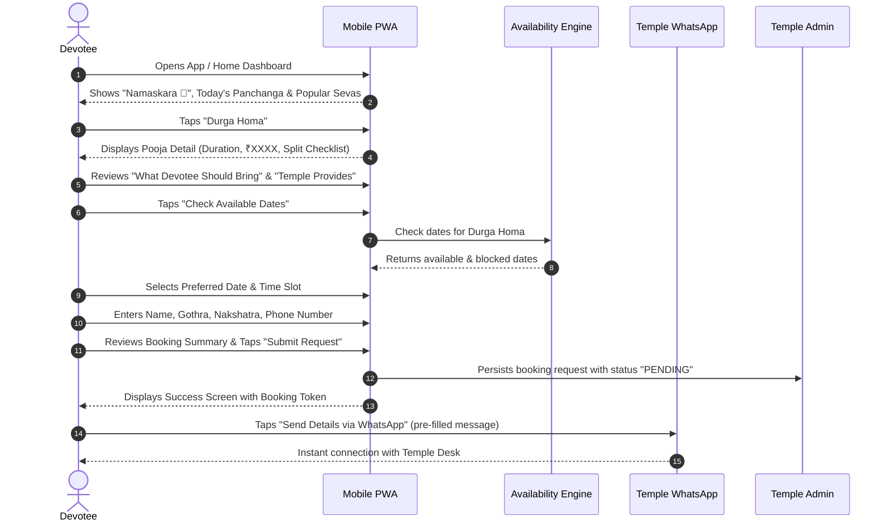
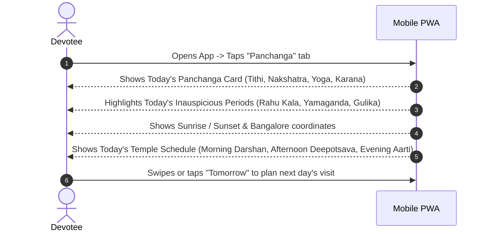
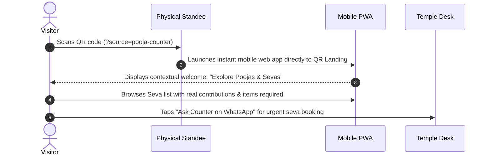
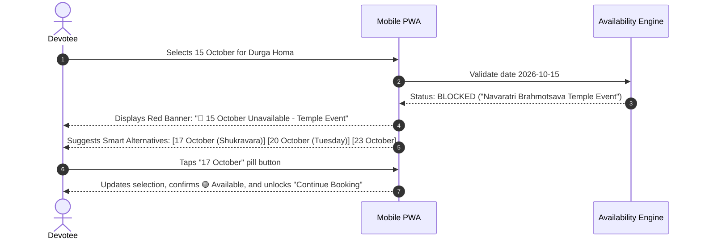
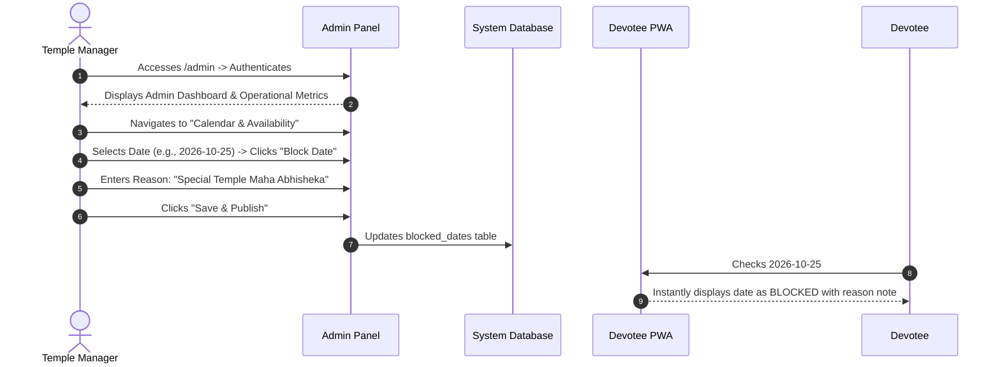

# Sri Durga Devi Temple — Devotee UX Journeys & Screen Flows

## Journey 1: Devotee Pooja & Homa Booking
**Goal:** Devotee discovers a seva, checks what is required, verifies date availability, and submits a booking request.

---

## Journey 2: Daily Panchanga & Temple Timings Check
**Goal:** Devotee checks whether today is auspicious, finds Rahu Kala, and confirms temple darshan hours.

---

## Journey 3: On-Premises QR Scan at Temple Physical Grounds
**Goal:** Physical temple visitor scans a QR standee at the pooja counter or entrance to avoid waiting in long enquiry lines.

---

## Journey 4: Date Conflict & Smart Alternative Recommendation
**Goal:** Devotee picks a date that is blocked by a temple festival; system intelligently guides them to next available auspicious dates.

---

## Journey 5: Temple Staff Administrative Control
**Goal:** Temple priest or manager logs into Admin Panel to block a date due to an unannounced temple ritual.

