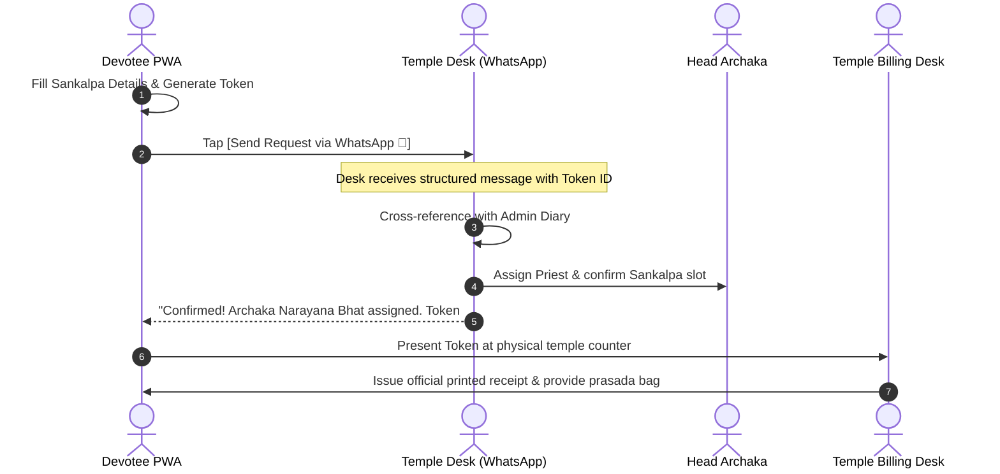

# WhatsApp-First Integration & Token Engine: Sri Durga Devi Temple

## 1. Rationale for WhatsApp-First Architecture
Rather than forcing devotees through rigid online payment gateways with merchant fees, OTP failures, and impersonal checkout carts, Digital Mandapa leverages **WhatsApp as the core communication and reservation backbone**:

1. **Elderly & Family Accessibility:** Every devotee in Bengaluru already uses WhatsApp daily.
2. **Personalized Archaka Connection:** Allows temple priests to confirm Gotra, Nakshatra, and custom Sankalpa wishes directly.
3. **Temple-Controlled Cash/UPI Counter Collection:** Devotees receive an official computer-printed receipt and prasad at the temple counter, maintaining traditional trust.
4. **Zero Commission Overhead:** 100% of the devotee's kanike reaches the temple trust.

---

## 2. Devotee Booking Token Specification

Every booking request generates an **Instant Verification Token** before dispatching to WhatsApp.

### Token Format:
$$\text{SDD}-\text{YYYY}-\text{MMDD}-\text{XXX}$$

- `SDD`: Sri Durga Devi Temple prefix
- `YYYY`: Booking year (e.g., `2026`)
- `MMDD`: Ritual month and day (e.g., `1024` for October 24)
- `XXX`: 3-digit randomized sequence / counter identifier (e.g., `042`)

*Example:* `SDD-2026-1024-042`

---

## 3. WhatsApp Message Templates & Deep-Link Generators

### Official Temple Endpoints:
- **Primary WhatsApp Desk:** `+91 98450 12345` (Chandra Layout Temple Desk)
- **Deep-Link Protocol:** `https://wa.me/919845012345?text={ENCODED_MESSAGE}`

### Template A: Seva Booking Request
```
Namaskara Sri Durga Devi Temple 🙏

I wish to request a Seva booking:

🪔 Seva: {SEVA_NAME} ({CONTRIBUTION})
📅 Date: {DATE}
⏰ Time: {TIME_SLOT}
👤 Devotee: {DEVOTEE_NAME}
📱 Mobile: {MOBILE}
🌿 Gothra: {GOTHRA}
⭐ Rashi / Nakshatra: {RASHI} / {NAKSHATRA}
🎯 Sankalpa: {SANKALPA_PURPOSE}
👨‍👩‍👧 Family: {ADDITIONAL_NAMES}

🎟️ Token ID: {TOKEN_ID}

I have noted the items to bring and will arrive 15 minutes before the seva. Please confirm Archaka assignment.
```

### Template B: Blocked Date / Alternative Date Inquiry
```
Namaskara Sri Durga Devi Temple 🙏

I noticed that {REQUESTED_DATE} is blocked for individual poojas due to {BLOCK_REASON}.

Can you please advise if {ALTERNATIVE_DATE} is suitable for performing {SEVA_NAME}?

Devotee Name: {DEVOTEE_NAME}
Mobile: {MOBILE}
```

### Template C: Physical Counter / On-Premises Scan Query
```
Namaskara Sri Durga Devi Temple 🙏

I am currently at the temple ({SPOT_LOCATION}). I would like to offer {SEVA_NAME} today. 

Please guide me to the correct counter or Archaka on duty.
```

---

## 4. Temple Office Desk Workflow


